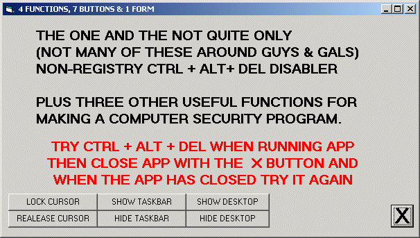



## Non\-Registry XP Security Functions v 1\.0\.0

### Description

Title: Non-Registry XP Security Functions v 1.0.0

Four functions, Six buttons and One form

show/hide desktop, show/hide taskbar, restrict/deresrict cursor to form AND disable/enable

Ctrl+Alt+Del Without using the registry (found in a forum somewhere out in net land)

This may be a bit of a hack but for better or worse if like me you dont like messing with the registry then lump it or loathe it this is for you &amp; respect the fact that I did not write this for any malign purposes

Bend it break it use it as you like but:-

If you like this code please vote for it
 
### More Info
 
See code

             |
---                |---
**Submitted On**   |2007-07-02 19:40:02
**By**             |[caver dave](https://github.com/Planet-Source-Code/PSCIndex/blob/master/ByAuthor/caver-dave.md)
**Level**          |Intermediate
**User Rating**    |5.0 (10 globes from 2 users)
**Compatibility**  |VB 6\.0
**Category**       |[Miscellaneous](https://github.com/Planet-Source-Code/PSCIndex/blob/master/ByCategory/miscellaneous__1-1.md)
**World**          |[Visual Basic](https://github.com/Planet-Source-Code/PSCIndex/blob/master/ByWorld/visual-basic.md)
**Archive File**   |[Non\-Regist207372722007\.zip](https://github.com/Planet-Source-Code/caver-dave-non-registry-xp-security-functions-v-1-0-0__1-68923/archive/master.zip)

### API Declarations

See code

